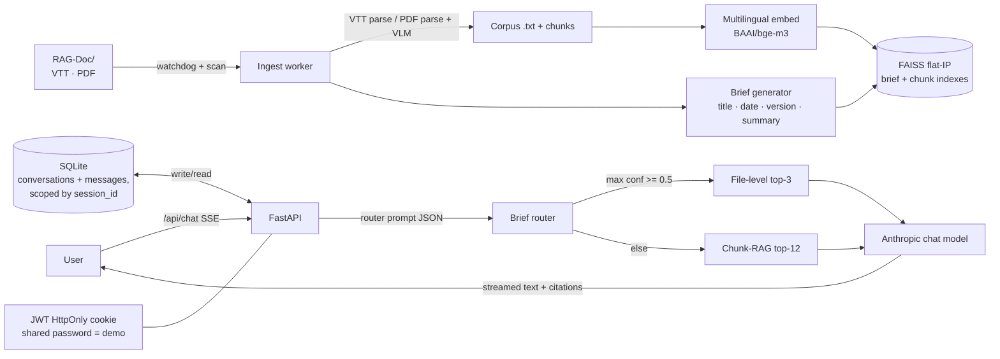

# vSmart Visibility AI Assistant

> Production-grade RAG over Cisco Catalyst SD-WAN vSmart meeting transcripts and
> product docs, with brief-routing, chunk-RAG fallback, vision-LM PDF
> understanding, auto-ingestion, and SSE streaming.
>
> **Triple purpose:** internal Cisco tool · portfolio · architectural prototype
> for a future Design Reasoning Agent.

## Why this exists

`RAG-Doc/` already holds 9 meeting transcripts (VTT + PDF), 2 vSmart wiki
exports, and the OMP statistics work plan (Traditional Chinese). The team
keeps re-asking *“What did Brad raise about real-time?”*, *“Which version
addressed the EC review feedback?”*, *“What does the OMP brief assume?”*. This
assistant answers those grounded in the actual transcripts and PDFs — with
clickable citations that open the source on disk.

Beyond the tool itself, the same pipeline (auto-ingest → brief → router →
retrieve → cite) is intentionally domain-agnostic so it can later be re-pointed
at design-project corpora — see [`docs/REUSE.md`](docs/REUSE.md).

## Architecture



## Repo layout

```
vSmart-Visibility/
├── backend/                    # FastAPI service (see backend/README.md)
├── src/                        # Vite + React frontend (Figma-converted layout)
│   └── app/
│       ├── auth/               # AuthProvider, LoginScreen, useAuth
│       ├── components/ai-assistant/
│       │   ├── AIAssistant.tsx # FAB + ChatPanel + Cmd+/ shortcut
│       │   ├── ChatPanel.tsx
│       │   ├── Message.tsx
│       │   ├── Citation.tsx
│       │   ├── IngestStatusFooter.tsx
│       │   ├── useChat.ts      # SSE reader
│       │   ├── useIngestStatus.ts
│       │   ├── api.ts
│       │   └── types.ts
│       └── App.tsx             # Existing dashboard wrapped by AuthGate
├── RAG-Doc/                    # Corpus (VTT, PDF, OMP plan)
├── docs/REUSE.md               # How to re-point this at another domain
├── docker-compose.yml          # One-command dev environment
├── vSmart_AI_Assistant_施工計畫_v2.1.pdf
└── README.md
```

## Getting started

### 1. Backend

```bash
cd backend
cp .env.example .env
# fill in ANTHROPIC_API_KEY and the four ANTHROPIC_*_MODEL ids
pip install -e .
uvicorn app.main:app --reload --port 8000
```

### 2. Frontend

```bash
npm install
npm run dev
```

Open <http://localhost:5173> — password is `demo` (case-insensitive). Hit
`Cmd+/` (or `Ctrl+/`) to toggle the assistant; `Esc` closes it.

### 3. Docker (optional)

```bash
docker compose up --build
# frontend → http://localhost:5173
# backend  → http://localhost:8000
```

## Design decisions log

| Decision | Why |
|---|---|
| **Brief-routing first, chunk-RAG fallback** | Files are heterogeneous (meetings vs PDFs vs work plans). A small structured brief lets a fast/cheap model pick the right *files*; chunk-RAG only kicks in when the router is unsure. Avoids the typical chunk-RAG failure mode of mixing loosely-related fragments. |
| **Multilingual embedding (`BAAI/bge-m3`)** | The OMP plan is Traditional Chinese; meetings are mostly English. Pure-English models silently fail on Chinese queries. Pluggable via `EMBEDDING_MODEL`. |
| **VLM only on image-heavy / text-sparse pages** | Cost control. PyMuPDF gives us image-area ratio cheaply; we only render and send pages above the threshold. |
| **Single shared password (`demo`), no User table** | Internal demo + portfolio. Saves a sub-system without weakening confidentiality (still HttpOnly + SameSite cookies, JWT, generic 401s). Trivially upgradable to multi-user later. |
| **Conversations scoped by `session_id`, not `user_id`** | Different browsers / sessions get isolated histories. Same trade-off as above. |
| **Model IDs ALL come from `.env`** | Anthropic IDs evolve. The plan explicitly forbids hardcoding them; configuration is enforced in `Settings`. |
| **`hmac.compare_digest` + case-folded compare** | UX win (`DEMO`/`Demo` works) without timing oracle. |
| **JSON-backed brief/hash/failure store** | Tiny dataset (≤ a few hundred files). Atomic-write through a temp file. v2 will move to DB. |

## Acceptance gates implemented (Plan §15 / §18)

- [x] Single password gate (case-insensitive); 401 on wrong password.
- [x] HttpOnly + SameSite=Lax cookie; 7-day rolling JWT.
- [x] Conversation persistence keyed by session_id (not user_id).
- [x] VTT + PDF parsers, with VLM hook on image-heavy / text-sparse pages.
- [x] Brief generation with `version` field; deterministic fallback when LLM is offline.
- [x] FAISS flat-IP indexes (briefs + chunks); multilingual embedding.
- [x] Auto-ingest: startup scan + watchdog (debounced + size-stable) + 5-min rescan + manual endpoint.
- [x] Brief router (JSON-only) with candidate slicing for >50 files.
- [x] Confidence-gated retrieval (default 0.5); chunk-RAG fallback otherwise.
- [x] SSE streaming chat with inline citations and file-resolving `/api/sources/{file_id}`.
- [x] Path-traversal protection in `_safe_resolve` (covered by tests).
- [x] No API key in frontend bundle (all Anthropic calls server-side).
- [x] Structured logging with redaction.
- [x] Tests for auth, sources, chunker, brief.

## Loom demo + GIFs

Recording slot reserved at `docs/loom.md` (link to be added once recorded).

## License

MIT
